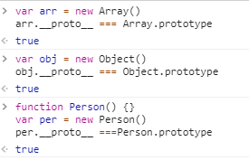
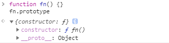

# Javascript 对象原型

> 任何对象都拥有`__proto__`属性(隐式)，一般指向他们的构造函数的原型(prototype)



> 原型链的顶端是 `Object.prototype` , 其 `__proto__` 是 `null`


> 所有函数都拥有 `prototype` 属性



> 所有函数都是`Function`的实例

```js
function fn() {}
console.log(fn.__proto__ === Function.prototype) // => true

var obj = {}

```