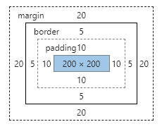

# Javascript 基础总结

## 目录

- [Javascript数据类型](#Javascript数据类型)
  - [String](#String)
  - [Number](#Number)
  - [Boolean](#Boolean)
  - [Symbol](#Symbol)
  - [Undefined](#Undefined)
  - [Null](#Null)
  - [Object](#Object)
- [Javascript Dom操作](#Dom操作)
  - [获取节点](#获取节点)
  - [节点指针](#节点指针)
  - [节点操作](#节点操作)
  - [属性操作](#属性操作)
  - [文本操作](#文本操作)
- [HTML Element](#HTML-Element)
  - [元素视图属性](#元素视图属性)
  - [Document文档视图](#Document文档视图)
  - [Document文档视图](#Document文档视图)

> JAVASCRIPT是基于对象和事件驱动的客户端脚本语言，弱类型语言，具有交互性、安全性、跨平台性三大特点。包含三个部分: _DOM、BOM、ECMASCRIPT_

- 【DOM】：当一个页面加载时，浏览器会把html文档呈现为具有元素、属性、属性值、文本的节点树, DOM提供了API并规范我们操作这些节点。
- 【BOM】：提供了独立于内容而与浏览器进行窗口进行交互的对象，可以对浏览器窗口进行交互和操作。核心对象window, window又包含子对象: `frames、history、location、navigator、screen`
- 【ECMASCRIPT】：ECMA规范定义了js作为一门编程语言的标准，包含变量基本类型、对象、函数、作用域、运算符、流程控制语句等

## Javascript数据类型

> - 基本类型: `Number、String、Boolean、Symbol、Undefined、Null`
> - 引用类型: `Object`， 包括 `Date、Array、RegExp`

### String

【1】常用操作方法：

- 字符操作: `charAt()、charCodeAt()、fromCharCode()`
- 字符串提取: `substr()、substring()、slice()`
- 位置索引: `indexOf()、lastIndexOf()`
- 大小写转换: `toLowerCase()、toUpperCase()`
- 模式匹配: `match()、search()、replace()、split()`
- 其他操作: `concat()、trim()、localCompare()`
- 类型转换: `toString()、String()、eval()`

### Number

【1】特殊数值：

- `Number.MAX_VALUE`：2^2014
- `Number.MIN_VALUE`：2^-1023
- `Number.MAX_SAFE_INTEGER`：2^53-1
- `Number.MIN_SAFE_INTEGER`：-(2^53-1)
- `Number.POSITIVE_INFINITY`：Infinity，正无穷
- `Number.NEGATIVE_INFINITY`：-Infinity，负无穷
- `Number.EPSILON`：是一个极小的值，用于检测计算结果是否在误差范围内
- `Number.NaN`：NaN与任何值都不相等，包括NaN自身，用`isNaN()`判断是不是为NaN
- `Infinity`：检测方法，`isFinite()`

【2】数值转换：

- `Number()`：`false`和`null`返回0，`true`返回1，`undefined`返回NaN
- `parseInt(string[,radix])`：radix标识以什么进制(2~32)转换数值
- `parseFloat()`

【3】位运算：

- 按位与：`&`，两个都为1(true)，结果为真
- 按位或：`|`，有一个为1(true)，结果为真
- 按位非：`~`， 真(1)即是假(0)，假(0)即是真(1)
- 按位异或：`^`，相同为假(0)，不同为真(1)
- 左移：`<<`
- 有符号右移：`>>`
- 无符号右移：`>>>`

【4】四舍五入：

- `ceil()`：向上取整
- `floor()`：向下取整
- `round()`：四舍五入取整
- `toFixed(num)`：四舍五入为指定小数位的数字
- `toPrecision(num)`：格式化为指定的长度，多余位补0

### Boolean

> - 两个值：`true false`
> - 所有类型的值都可以转化为与Boolean等价的值，所有对象都被当作true，`''、null、undefined、0、NaN`被当作false

【1】关系操作符：`> < >= <=`

【2】相等操作符：`== != === !==`

【3】布尔操作符：`!`

【4】条件语句：`if while do-while`

### Symbol

### Undefined

> 表示一个变量最原始的状态，而非人为操作的结果
> 区分空对象指针与尚未定义的变量, 对未初始化的变量及未声明的变量使用typeof运算符均会返回undefined

- 声明了一个变量，但没有赋值
- 访问对象上不存在的属性
- 函数定义了形参，但是没有传实参
- 使用`void`对表达式求值

### Null

> 表示一个对象被人为的重置为空对象，而非一个变量最原始的状态
> 逻辑上null表示一个空对象的指针，使用typeof检测时会返回object

【1】undefined与null的关系：

- undefined派生于null,因此使用'=='比较时，会返回true
- 没有必要将变量值显示声明为undefined
- 声明空对象时应将其赋值为null

### Object


> 引用类型

## Dom操作

### 获取节点

> 通过元素的id属性、name属性、标签名获取节点
> 除getElementById之外，其他获取的都是节点集合

- document.getElementById("id");
- document.getElementsByTagName("p");
- document.getElementsByName("name");
- document.getElementsByClassName("container-div");

### 节点指针

> 注意：节点操作时候html结构中的各种空格，换行符都可能会把文本节点当做同胞元素处理。如firstChild查询的第一个节点为空文本节点, firstElementChild才是你需要的元素节点

- `parentObj.firstchild`（IE6、7、8获取第一个元素节点，非IE6、7、8获取第一个节点）
- `parentObj.firstElementChild`（IE6、7、8不支持）
- `parentObj.lastchild`
- `parentObj.lastElementChild`
- `parentObj.childNodes`（IE只获取元素节点，非IE获取元素节点与文本节点）
- `parentObj.children`
- `neborNode.previousSibling`
- `neborNode.nextSibling`
- `childNode.parentNode`

### 节点操作

1. 创建节点:
    - `document.createElement("元素标签")`
    - `document.createAttribute("元素属性")`
    - `document.createTextNode("文本内容")`
2. 插入节点
    - `document.insertBefore(newCode,referenceChild)`
    - `parentNode.appendChild(newNode)`
    - `element.insertAdjacentHTML(position, text); position: beforebegin | afterbegin | beforeend | afterend`
3. 替换节点
    - `replaceChild`
4. 复制节点
    - `cloneNode(true/false)`
5. 删除节点
    - `parentNode.removeChild(node)`

### 属性操作

1. 获取属性：`getAttribute(name)`
2. 设置属性：`setAttribute(name,value)`
3. 删除属性：`removeAttribute(name)`

#### 特殊属性class操作

1. element.className: 字符串操作 全兼容
2. element.classlist：IE10+
    - add()
    - remove()
    - item()
    - toggle()
    - contains()
    - replace()

### 文本操作

1. 插入文本：insertData(offset,string) -> 从offset指定的位置插入string
2. 追加文本：appendData(string) -> 将string插入到文本节点的末尾处
3. 删除文本：deleteData(offset,count) -> 从offset起删除count个字符
4. 替代文本：replaceData(offset,count,string) -> 从offset起将count个字符替换为string
5. 分离文本：splitData(offset) -> 从offset起将文本节点分为两个节点
6. 返回节点：substringData(offset,count) -> 返回由offset起的count个字符

## HTML-Element

### 元素视图属性



```css
div {
  width: 200px;
  height: 200px;
  padding: 10px;
  border: 5px solid lightgreen;
  margin: 20px;
  background: lightskyblue;
}
```

- *client*:
  - clientWidth (width + 左右padding) = 220
  - clientHeight (height + 上下padding) = 220
  - clientTop (border.top) = 5
  - clientLeft (botder.left) = 5
- *offset*：
  - offsetWidth (width + 左右padding + 左右border) = 230
  - offsetHeight (width + 上下padding + 上下border) = 230
  - offsetLeft (到offsetParent的内边距) = 20
  - offsetTop (到offsetParent的内边距) = 20
- *scroll*：
  - scrollWidth：真实宽度（可视区域宽度+被隐藏区域宽度）= 220
  - scrollHeight：真实高度（可视区域高度+被隐藏区域高度）= 220
  - scrollTop：内容层顶部 到 可视区域顶部的距离 = 0
  - scrollLeft：内容层左端 到 可视区域左端的距离 = 0
- *getBoundingClientRect()*:
  - bottom: 元素底边（包括border）到可视区最顶部的距离
  - left: 元素最左边（不包括border）到可视区最左边的距离
  - right: 元素最右边（包括border）到可视区最左边的距离
  - top: 元素顶边（不包括border）到可视区最顶部的距离
  - height: 元素的offsetHeight
  - width: 元素的offsetWidth
  - x: 元素左上角的x坐标
  - y: 元素左上角的y坐标
- *scrollIntoView()*：滚动到可视区域
- *window.getComputedStyle(ele).getPropertyValue("transform")*：得到实际的transform值, martix()

### Window视图属性

> 浏览器窗口可视区宽度（*不包括浏览器控制台、菜单栏、工具栏*）（<IE9不支持）

- innerWidth
- innerHeight

### Document文档视图

> 低版本IE的innerWidth、innerHeight的代替方案
> 浏览器窗口可视区宽度（*不包括浏览器控制台、菜单栏、工具栏、滚动条*）

- *client*:
  - document.documentElement.clientWidth
  - document.documentElement.clientHeight
- *ffset*:
  - document.documentElement.offsetHeight：整个文档高度
  - document.body.offsetHeight：整个文档高度（不包含body的margin）
- *scroll*:
  - document.documentElement.scrollTop: 返回文档的滚动top方向的距离（当窗口发生滚动时值改变）
  - document.documentElement.scrollLeft

## Js遍历

```js
for(var i = 0; i < arr.length; i++) { }

for(var i of arr) { }

for(var i in arr) { }

arr.forEach((item, index, arr) => { })

arr.map((value,index,array) => { })
```
