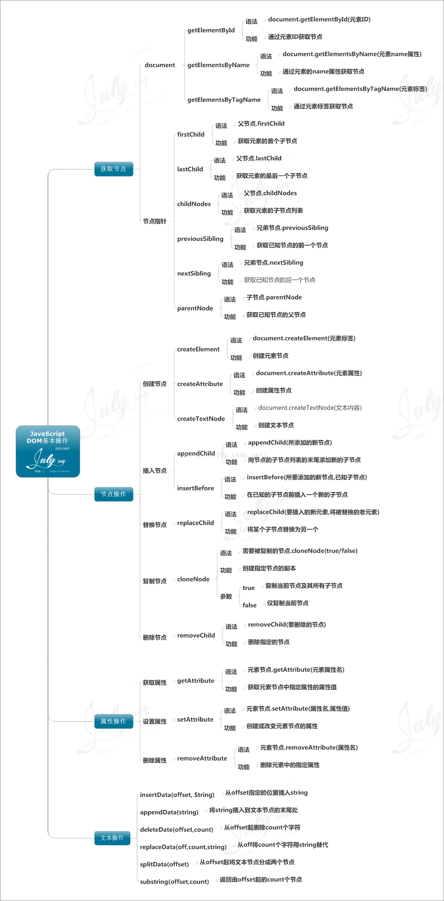

# 【Javascript基础】-DOM

- [Javascript DOM操作](#基础DOM操作)
  - [Ⅰ.获取节点](#Ⅰ.获取节点)
  - [Ⅱ.节点操作](#Ⅱ.节点操作)
  - [Ⅲ.属性操作](#Ⅲ.属性操作)
  - [Ⅳ.文本操作](#Ⅳ.文本操作)

## 基础DOM操作

### Ⅰ.获取节点

#### document

> 提示：除getElementById之外，其他获取的都是节点集合

- `document.getElementById("id")`
- `document.getElementsByTagName("p")`
- `document.getElementsByName("name")`
- `document.getElementsByClassName("container-div")`

#### 节点指针

> 注意：节点操作时候html结构中的各种空格，换行符都可能会把文本节点当做同胞元素处理。如firstChild查询的第一个节点为空文本节点, firstElementChild才是你需要的元素节点

- `parentNode.firstchild`（IE6、7、8获取第一个元素节点，非IE6、7、8获取第一个节点）
- `parentNode.firstElementChild`（IE6、7、8不支持）
- `parentNode.lastchild`
- `parentNode.lastElementChild`
- `parentNode.childNodes`（IE只获取元素节点，非IE获取元素节点与文本节点）
- `parentNode.children`
- `neborNode.previousSibling`
- `neborNode.nextSibling`
- `childNode.parentNode`

### Ⅱ.节点操作

1. 创建节点:
    - `document.createElement("元素标签")`
    - `document.createAttribute("元素属性")`
    - `document.createTextNode("文本内容")`
2. 插入节点
    - `document.insertBefore(newNode,referenceChild)`
    - `parentNode.appendChild(newNode)`
    - `element.insertAdjacentHTML(position, html)` (position: beforebegin | afterbegin | beforeend | afterend)
    - `element.insertAdjacentText(position, text)`
    - `element.insertAdjacentText(position, element)`
3. 替换节点
    - `replaceChild`
4. 复制节点
    - `cloneNode(true/false)`
5. 删除节点
    - `removeChild(node)`

```js
var myDiv = document.createElement("div")
var body = document.getElementsByTagName("body")
body.insertAdjacentElement("afterbegin", myDiv)
```

#### 节点属性

- `nodeName`
- `nodeValue`
- `nodeType`: 元素(1), 属性(2), 文本(3), 注释(8), 文档(9)

### Ⅲ.属性操作

1. 获取属性：`getAttribute(name)`
2. 设置属性：`setAttribute(name,value)`
3. 删除属性：`removeAttribute(name)`

#### 特殊属性class操作

1. `element.className`: 字符串操作 全兼容
2. `element.classlist`：IE10+
    - `add()`
    - `remove()`
    - `item()`
    - `toggle()`
    - `contains()`
    - `replace()`

### Ⅳ.文本操作

1. `insertData(offset,string)` -> 从offset指定的位置插入string
2. `appendData(string)` -> 将string插入到文本节点的末尾处
3. `deleteData(offset,count)` -> 从offset起删除count个字符
4. `replaceData(offset,count,string)` -> 从offset起将count个字符替换为string
5. `splitData(offset)` -> 从offset起将文本节点分为两个节点
6. `substringData(offset,count)` -> 返回由offset起的count个字符

