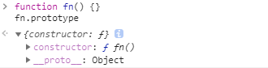
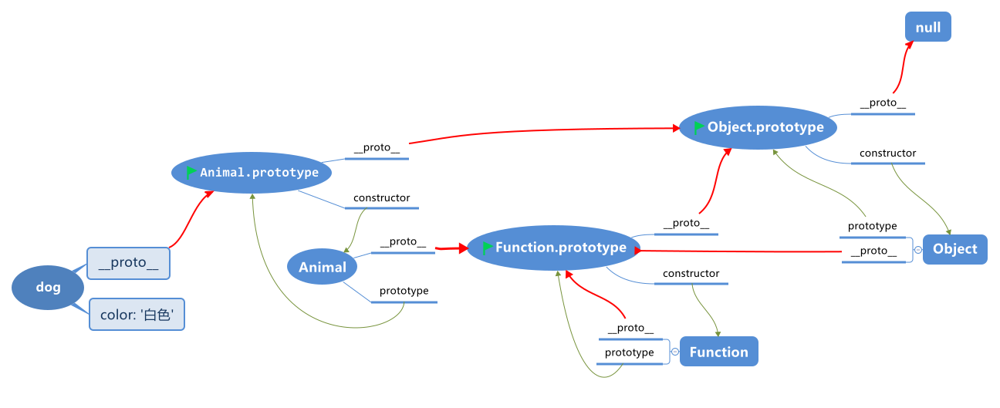
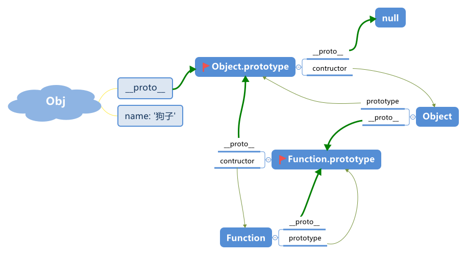
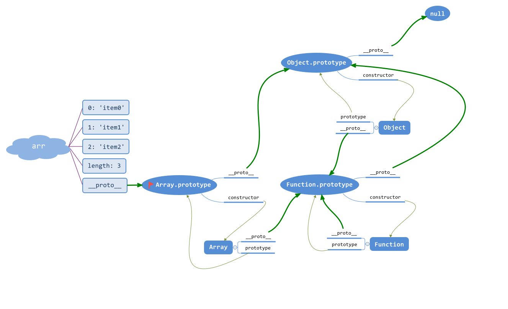
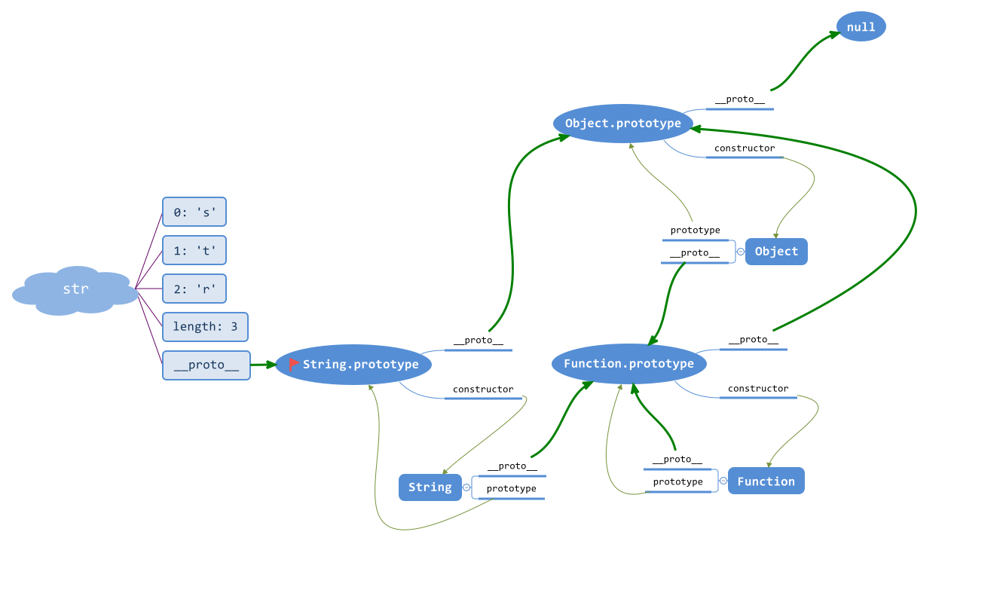

# Javascript 对象原型与原型链

## 一、原型对象

> ① **任何对象都拥有`__proto__`属性(隐式)，一般指向他们的构造函数的原型(prototype)**

```js
let arr = new Array()
arr.__proto__ === Array.prototype  //true

let obj = new Object()
obj.__proto__ === Object.prototype //true

function Person () { }
let per = new Person()
per.__proto__ === Person.prototype //true
```

> ② **原型链的顶端是 `Object.prototype` , 其 `__proto__` 是 `null`**

```js
> Array.prototype.__proto__ === Object.prototype
true
> let Person = function(){}
  Person.prototype.__proto__ === Object.prototype
true
> Function.prototype.__proto__ === Object.prototype
true
```


> ③ **所有函数都拥有 `prototype` 属性**



> ④ **所有函数都是`Function`的实例, 包括常用的 `Array、Function、Object ...`**

```js
//fn由构造函数创建出来
function fn() {}
fn.__proto__ === Function.prototype // => true

let obj = {} // 等同于 let obj = new Object()
let arr = [] // 等同于 let arr = new Array()
obj.__proto__ === Object.prototype // => true
arr.__proto__ === Array.prototype  // => true

//当我们通过构造函数的方式来创建一个对象,其本质也是new一个普通的函数
Function.__proto__ === Function.prototype    //true, Function创造了所有函数，同时他自身也是个函数，如同自己创建了自己
Array.__proto__ === Function.prototype       //true
RegExp.__proto__ === Function.prototype      //true
Object.__proto__ === Function.prototype      //true
```

> ⑤ **每个原型对象都有constructor属性, 该属性指向函数本身**

```js
let Person = function(){}
let per = new Person()
Object.prototype.constructor === Object      //true
Function.prototype.constructor === Function  //true
RegExp.prototype.constructor === RegExp      //true
Person.prototype.constructor === Person      //true


/*
 * 解析：fn自身没有contructor,所以会顺着原型链向上找
 * fn的 '__proto__'指向 Function.prototype, 所以Function.prototype.constructor === Function
 */
function fn(){}
fn.constructor === Function         //true
Function.constructor === Function   //true
Object.constructor === Function     //true
```

## 二、原型链

> 当我们获取一个对象的属性或行为，首先会在对象自身寻找，没有的话就通过`__proto__`一层层的继续向上寻找，直到原型链的顶端 `Object.prototype.__proto__`**( null )**，这种通过某个纽带(`__proto__`)形成的继承关系，呈现出链条的形状，遂将之成为原型链

## 三、几个典型的原型图

### 3.1 构造函数创建对象字面量原型链图

```js
function Animal (color) {
  this.color = color
}
var dog = new Animal('白色')

> dog.__proto__ === Animal.prototype  //true

> Animal.__proto__ === Function.prototype //true
> Object.__proto__ === Function.prototype //true
> Function.__proto__ === Function.prototype //true

> Animal.prototype.__proto__ === Object.prototype //true
> Function.prototype.__proto__ === Object.prototype //true

> Object.prototype.__proto__ === null //true

> Animal.prototype.constructor === Animal
> Function.prototype.constructor === Function
> Object.prototype.constructor === Object
```



### 3.2 对象字面量原型链图

```js
var obj = {
  name: '狗子'
}

> obj.__proto__ === Object.prototype
> Object.__proto__ === Function.prototype
> Function.__proto__ === Function.prototype

> Function.prototype.__proto__ === Object.prototype
> Object.prototype.__proto__ === null

> Object.prototype.constructor === Object
> Function.prototype.constructor === Function
```



### 3.3 数组原型链

```js
let arr = ['item0', 'item1', 'item2']

arr.__proto__ === Array.prototype
Array.__proto__ === Function.prototype
Function.__proto__ === Function.prototype
Object.__proto__ === Function.prototype

Array.prototype.__proto__ === Object.prototype
Function.prototype.__proto__ === Object.prototype
Object.prototype.__proto__ === null

Array.prototype.constructor === Array
Object.prototype.constructor === Object
Function.prototype.constructor === Function
```



### 3.4 基本包装类型原型链

```js
let str = 'str' // let str = new String('str')

str.__proto__ === String.prototype
String.__proto__ === Function.prototype
String.prototype.__proto__ === Object.prototype
```



## 参考文献

[深入浅出javascript对象原型](https://www.jianshu.com/p/aa2f885ba871)
