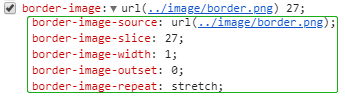
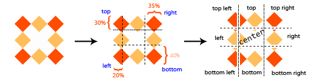
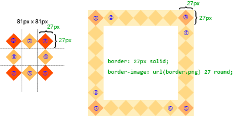
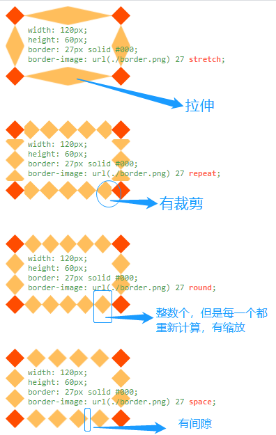

# border-image

## border-image参数

```css
width: 120px;
height: 60px;
border: 27px solid #000;
border-image: url(./border.png) 27 stretch;
```



### 一. border-image-source(图片源)

> 类似于background-image的url()。 指定一个图像源以代替`border-style`的呈现

### 二. border-image-slice(图片剪裁位置)

Formal syntax：`border-image-slice:[<number> | <percentage>]{1,4} && fill ?`

```css
border-image-slice: 30%; /* 所有的边 */

border-image-slice: 10% 30%; /* 垂直方向 | 水平方向 */

border-image-slice: 30 30% 45; /* 顶部 | 水平方向 | 底部 */

border-image-slice: 7 12 14 5; /* 上 右 下 左 */

border-image-slice: 10% 7 12 10 fill; /* 使用fill（fill可以放在任意位置） */

border-image-slice: inherit; /* Global values */
border-image-slice: initial;
border-image-slice: unset;
```

1. `number`没有单位，专指像素。例如`border-image:url(border.png) 27 repeat`
2. `percentage`相对于边框背景图片取值百分比。例如`border-image:url(border.png) 50% repeat`
3. `fill`决定了九宫格中间的图片用不用，默认是丢弃的。这个在下面会提及

- `number`和`percentage`都可以有1-4个值，和css通用的取值规则一样。类比`magin、padding`
  - 指定一个值时，它会将相同的值应用于所有的四个边
  - 指定两个值时，第一个应用于顶部和底部，第二个应用于左侧和右侧
  - 指定三个值时，第一个应用于顶部，第二个应用于左右两边，第三个值应用于底部
  - 指定四个值时，将按照该顺序（顺时针）应用于顶部，右侧，底部和左侧

#### 剪裁特性

`border-image:url(border.png) 30% 35% 40% 20% repeat`, 边框的背景图片会被怎样剪裁？



①. 按照上右下左顺时针顺序，在30%，35%，40%，20%的地方各切一刀，就形成了一个九宫格

**关键点来了，切割后的图片怎么放进border中**？？？

②. 为了说明这个问题，我们这次切均匀点，如下左图，81*81的边框背景图，我们在27(top, right, bttom, left)的位置下刀它四刀. 下右图就是页面效果图，对比上面的图，就可以很清楚的明白，top-left, top-right, bottom-right, bottom-left就直接放在了border的四个角（对应下图①、③、⑤、⑦）；那么top, right, bottom, left也可以看出它们被复制了很多份然后再放进border中。默认中间的部分直接丢弃了。那么这个复制的效果就该`border-image-repeat`表演了...



### 三. border-image-repeat

`Formal syntax: [ stretch | repeat | round | space ]{1,2}`

- stretch(拉伸)：图像被拉伸以填充该区域, 默认值
- repeat(重复)：图像被重复以填充区域
- round(平铺)：图像被平铺以填充该区域。如果没有用整块切片填充该区域，则会重新缩放图像以使其填充。
- space(间隙平铺)：平铺图像 。当不能整数次平铺时，会用空白间隙填充在图像周围（不会放大或缩小图像）

类似我们设置过的壁纸，拉伸很好理解，`round、repeat、space`有点让人懵逼。举个贴瓷砖的例子，6m*1m的通道，瓷砖的大小是`125cm*100cm`, repeat的方式就是一块一块的贴，两边再切快小的补; round就是，我反正买了5块瓷砖，边角料也没啥用，为了好看我费点力每块切成`120cm*100cm`的，这样刚好; space就是我就贴4块，每块之间留点间隙算了，得过且过。

**然后**；上实例



### 四. border-image-width

`Formal syntax => border-image-width: [ <length> | <percentage> | <number> | auto ]{1,4}`

> 复合写法应位于slice属性和repeat属性之间，用"/"隔开：`border-image:url(border.png) 27 / 6rem / repeat`

```css
border-image-width: auto;   /* Keyword value */

border-image-width: 1rem;   /* <length> value */

border-image-width: 25%;    /* <percentage> value */

border-image-width: 3;    /* <number> value */

border-image-width: 2em 3em;    /* vertical | horizontal */

border-image-width: 5% 15% 10%;   /* top | horizontal | bottom */

border-image-width: 5% 2em 10% auto;    /* top | right | bottom | left */

border-image-width: inherit;    /* Global values */
border-image-width: initial;
border-image-width: unset;
```

| 属性值 | 描述 |
| :- | :- |
| length | 以绝对或相对单位指定边框的宽度 |
| percertage | 指定边框的宽度，以元素的百分比表示 |
| number | 表示元素border-width属性的计算值或边框宽度的倍数 |
| auto | 指定边框图像时相应图像切片的固有宽度或高度 |

> If two opposite border-image-width offsets are large enough that they overlap, then the used values of all border-image-width offsets are proportionally reduced until they no longer overlap. In mathematical notation: Given Lwidth as the width of the border image area, Lheight as its height, and Wside as the border image width offset for the side side, let f = min(Lwidth/(Wleft+Wright), Lheight/(Wtop+Wbottom)). If f < 1, then all W are reduced by multiplying them by f.

[原文来自w3.org](https://www.w3.org/TR/css-backgrounds-3/#propdef-border-image-width)

> 如果两个相对的“border-image-width”偏移足够大以至于它们重叠，则所有“border-image-width”偏移的使用值将按比例减小，直到它们不再重叠为止。在数学表示法中：给定Lwidth作为图像边框区域的宽度，Lheight作为其高度，Wside作为鞭策的图像边框宽度偏移，let f = min(Lwidth/(Wleft+Wright), Lheight/(Wtop+Wbottom)). 如果 f = 1，则所有W都通过乘以f来减少。

<html>
  <div class="mt10" style="width:500px; height:300px; border:1px solid #cccccc;">
    <object classid="clsid:D27CDB6E-AE6D-11cf-96B8-444553540000" width="500" height="300">
      <param name="movie" value="libs/border_image.swf">
      <param name="quality" value="high">
      <param name="wmode" value="opaque">
      <param name="swfversion" value="9.0.45.0">
      <embed width="500" height="300" wmode="opaque" src="libs/border_image.swf" type="application/x-shockwave-flash">
    </object>
  </div>
</html>

## 总结(绘制步骤)(Drawing the Border Image)

> 使用`border-image-slice`值对`border-image-source`给定的背景图片进行切片之后，通过四个步骤将生成的9张图像缩放，定位并平铺到其对应的图片边框区域中：

1. 根据`border-image-width`缩放。(Scale to `border-image-width`)
   - 顶部和底部边缘的两个图像分别与顶部和底部边界图像区域部分一样高，并且它们的宽度按比例缩放（对应图一中的top、bottom）
   - 左边缘和右边缘的图像分别制作成与左边界图像区域和右边界图像区域一样宽，并且它们的高度按比例缩放（对应图一中的left、right）。
   - 角图像被缩放为与它们所属于的两个边界图像边缘一样宽和一样高。
   - 除非中间因子的宽度为零或无穷大，否则中间图像的宽度将按与顶部图像相同的比例缩放，在这种情况下，将替换底部的比例因子，否则将无法缩放宽度。除非该因数为零或无穷大，否则中间图像的高度将按与左图像相同的比例缩放，在这种情况下，将替换右图像的比例因子，否则将无法缩放高度。

2. 根据`border-image-repeat`调整。(Scale to `border-image-repeat`)
   - 如果第一个关键字是`Stretch`，则顶部，中间和底部图像(对应图一中的top、center、bottom)将进一步缩放为与图像边框区域的中间部分（大部分时候就是你定义的盒子的宽度）一样宽。高度不再更改。
   - 如果第一个关键字是`round`，那么将调整顶部，中间和底部(对应图一中的top、center、bottom)图像的宽度，以使它们的全部恰好适合边框图像区域的中间部分（整数倍平铺），这与`background-repeat`属性中的`round`完全一样。
   - 如果第一个关键字是`repeat`或`space`，则顶部，中间和底部的图像将不再更改。
   - 第二个关键字的`Stretch，round，repeat&space`的效果类似，作用于左，中和右图像的高度。

3. 放置第一个图块。(Position the first tile.)
   - 如果第一个关键字是`repeat`，则顶部，中间和底部图像(对应图一中的top、center、bottom)在其各自区域中水平居中。否则，图像将放置在边框图像区域各自部分的左边缘。
   - 如果第二个关键字是`repeat`，则左，中和右图像在其各自区域中垂直居中。否则，图像将放置在边框图像区域各自部分的顶部边缘。

4. 平铺并绘制。
   - 然后将图像平铺以填充它们各自的区域。
   - 在使用`space`的情况下，将丢弃任何部分切片，并在切片之前，之后和之间分配额外的空间。（即，第一个图块之前的间隙，最后一个图块之后的间隙以及图块之间的间隙是相等的。）这可能会导致边框图像侧面区域空白。
   - 在与正常边界相同的层级上绘制图像：紧接在背景层之前。
   - 除非为`border-image-source`指定填充（fill），否则不会绘制中间图像(对应图一中的center切片默认会丢弃)。

- [W3C Border Images](https://www.w3.org/TR/css-backgrounds-3/#border-images)
- [CSS3 border-image详解、应用(张鑫旭)](https://www.zhangxinxu.com/wordpress/2010/01/css3-border-image)
- [MDN Border Images](https://developer.mozilla.org/zh-CN/docs/Web/CSS/border-image)