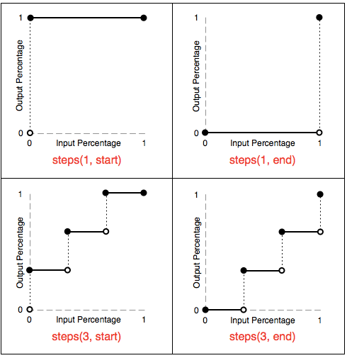

# CSS3 重点

## CSS盒模型

一. W3C的标准Box Model => **content-box**

1. *元素空间尺寸*
   - `Element width = [content width] + [padding] + [border width] + margin`
2. *元素大小（内盒尺寸计算）*
   - `Element width = [content width] + [padding] + [border width]`

二. IE传统下Box Model(IE6以下) => **border-box**

> content width包含内容宽度、边框宽度、内距宽度

1. 元素空间尺寸（外盒尺寸计算）
   - `Element width = [content width] + margin`
2. 元素大小
   - `Element width = content Width`

## 话说Transition这厮

1. *transition-property*：none|all|property
2. *transition-duration*：
3. *transition-function*：linear| ease|ease-in|ease-out|ease-in-out|cubic-bezier(n,n,n,n)
4. *transition-delay*：

## animation动画

```css
animation: name duration timing-function delay iteration-count diection
```

1. *animation-name*：`@keyframe`的名称
2. *animation-duration*：动画所花费的时间，单位`m`或者`ms`
3. *animation-timing-function*：动画的速度曲线
4. *animation-delay*：动画开始之前的延迟
5. *animation-iteration-count*：动画播放的次数, 值`n|infinite`
6. *animation-direction*：规定是否应该轮流反向播放动画, 值`normal|alternate`
7. *animation-play-state*：规定动画是否正在运行或暂, 值`paused|running`
8. *animation-fill-mode*：规定对象动画时间之外的状态, 值`none|forwards|backwards|both`

### animation属性animation-timing-function

#### 线性动画


1. linear == cubic-bezier(0,0,1,1)
2. ease == cubic-bezier(0.25,0,0.25,1)
3. ease-in == cubic-bezier(0.42,0,1,1)
4. ease-out == cubic-bezier(0,0,0.58,1)
5. ease-in-out == cubic-bezier(0.42,0,0.58,1)
6. in-out-back == cubic-bezier(0.68,-0.55,0.27,1.55)

**扩展**：

- 'easeInCubic': 'cubic-bezier(.550,.055,.675,.190)',
- 'easeOutCubic': 'cubic-bezier(.215,.61,.355,1)',
- 'easeInOutCubic': 'cubic-bezier(.645,.045,.355,1)',
- 'easeInCirc': 'cubic-bezier(.6,.04,.98,.335)',
- 'easeOutCirc': 'cubic-bezier(.075,.82,.165,1)',
- 'easeInOutCirc': 'cubic-bezier(.785,.135,.15,.86)',
- 'easeInExpo': 'cubic-bezier(.95,.05,.795,.035)',
- 'easeOutExpo': 'cubic-bezier(.19,1,.22,1)',
- 'easeInOutExpo': 'cubic-bezier(1,0,0,1)',
- 'easeInQuad': 'cubic-bezier(.55,.085,.68,.53)',
- 'easeOutQuad': 'cubic-bezier(.25,.46,.45,.94)',
- 'easeInOutQuad': 'cubic-bezier(.455,.03,.515,.955)',
- 'easeInQuart': 'cubic-bezier(.895,.03,.685,.22)',
- 'easeOutQuart': 'cubic-bezier(.165,.84,.44,1)',
- 'easeInOutQuart': 'cubic-bezier(.77,0,.175,1)',
- 'easeInQuint': 'cubic-bezier(.755,.05,.855,.06)',
- 'easeOutQuint': 'cubic-bezier(.23,1,.32,1)',
- 'easeInOutQuint': 'cubic-bezier(.86,0,.07,1)',
- 'easeInSine': 'cubic-bezier(.47,0,.745,.715)',
- 'easeOutSine': 'cubic-bezier(.39,.575,.565,1)',
- 'easeInOutSine': 'cubic-bezier(.445,.05,.55,.95)',
- 'easeInBack': 'cubic-bezier(.6,-.28,.735,.045)',
- 'easeOutBack': 'cubic-bezier(.175, .885,.32,1.275)',
- 'easeInOutBack': 'cubic-bezier(.68,-.55,.265,1.55)'

#### 阶跃动画

```css
animation: steps(正整数, start|end)
```

> timing-function 作用于每两个关键帧之间，而不是整个动画



#### 贝塞尔曲线

[贝塞尔曲线讲解](https://www.jianshu.com/p/0c9b4b681724)
[Cubic-bezier](http://cubic-bezier.com)

## filter()

- `url()`: 接受一个xml文件，该文件设置了一个svg滤镜
- `blur()`: 高斯模糊
- `brightness()`: 给图片应用一种线性乘法，使其看起来更亮或更暗。0%全黑，100%无变化，>100%更亮
- `contrast()`: 调整图像的对比度。0%全黑，100%不变，>100%运用更低的对比度
- `drop-shadow()`: 给图像设置一个阴影效果
- 
