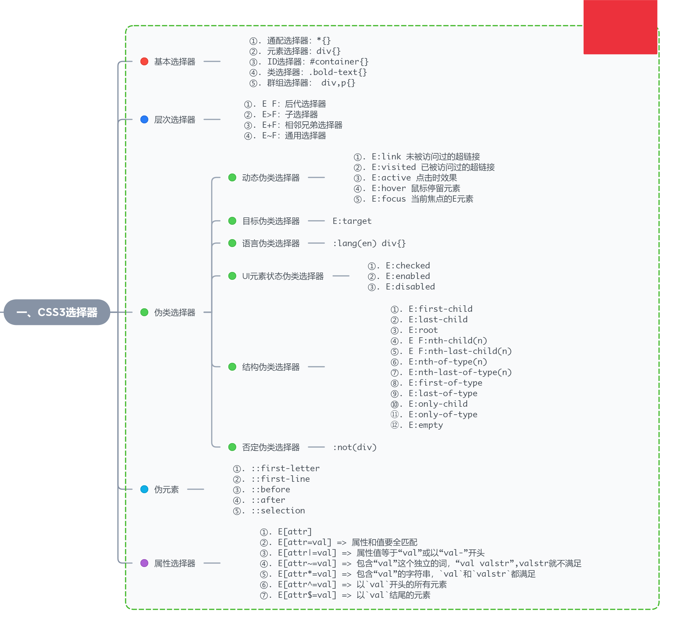

# 图解CSS3:核心技术与案例实战

## 一、揭开CSS3的面纱

### css3的新特性

1. 强大的css3选择器
2. 抛弃图片的视觉效果：比如圆角、渐变效果可以代码直接实现
3. 背景的变革：一个元素设置多背景图片、background-clip等
4. 盒模型的变化：弹性盒子
5. 阴影效果：text-shadown & box-shadown
6. 多列布局与弹性盒模型布局
7. Web字体和Web Font图标
8. 颜色与透明度
9. 圆角与边框的新法: border-radius & border-image
10. 盒容器的变形
11. css3过过渡与动画交互效果
12. 媒体特性与Responsive布局

## 二、css3选择器



### 动态伪类选择器

锚点伪类必须遵循一个爱恨原则（LoVe/HAte），也就是`link-visited-hover-active`

### 目标伪类选择器(:target)

> URL 带有后面跟有锚名称 #，指向文档内某个具体的元素。这个被链接的元素就是目标元素(target element) :target 选择器可用于选取当前活动的目标元素。

比如`http://192.168.1.191:8081/2-4.html#brand`, :target就是id为brand的元素

### 结构伪类选择器

```xml
<div class="post">
  <h2>我是标题</h2>
  <p>我是文章中的第一个段落</p>
  <p>我是文章中的第二个段落</p>
</div>
```

1. `.post>p:nth-child(2)` 选中的是第一个p
2. `.post>p:nth-of-type(2)` 选中第二个p段落
3. 如果`h2`前面插入一个`h1`，那么`.post>p:nth-child(2)`将无法选中任何元素
4. `:nth-child(2n) == :nth-child(even)`
5. `:nth-child(2n+1) == :nth-child(2n-1) == :nth-child(odd)`

### 伪元素

伪元素不包含在DOM中
