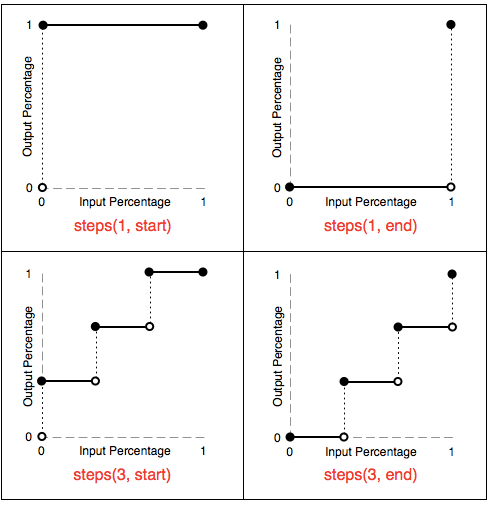

# CSS3 重点

## animation动画

```css
animation: name duration timing-function delay iteration-count diection
```

1. *animation-name*：`@keyframe`的名称
2. *animation-duration*：动画所花费的时间，单位`m`或者`ms`
3. *animation-timing-function*：动画的速度曲线
4. *animation-delay*：动画开始之前的延迟
5. *animation-iteration-count*：动画播放的次数, 值`n|infinite`
6. *animation-direction*：规定是否应该轮流反向播放动画, 值`normal|alternate`
7. *animation-play-state*：规定动画是否正在运行或暂, 值`paused|running`
8. *animation-fill-mode*：规定对象动画时间之外的状态, 值`none|forwards|backwards|both`

### animation属性animation-timing-function

#### 阶跃动画

```css
animation: steps(正整数, start|end)
```

> timing-function 作用于每两个关键帧之间，而不是整个动画

