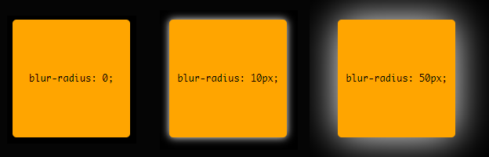
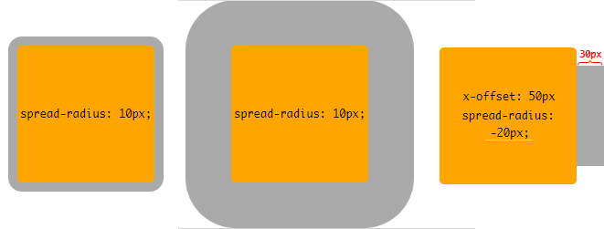
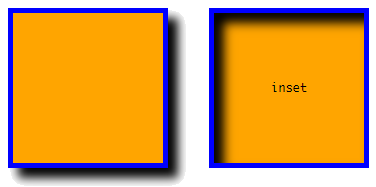
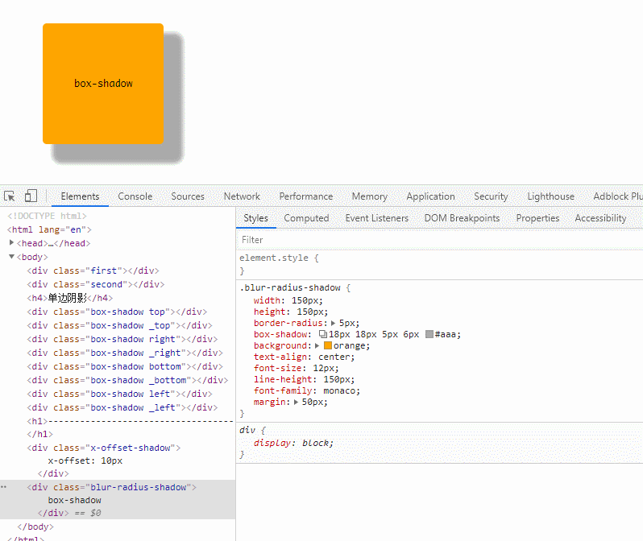
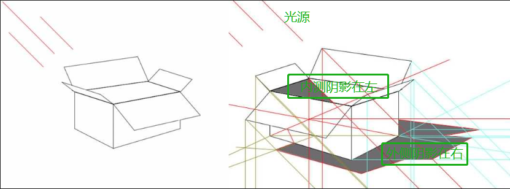
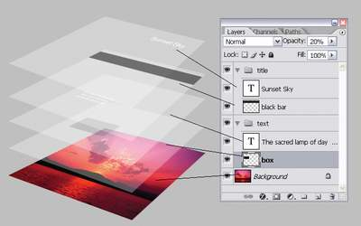
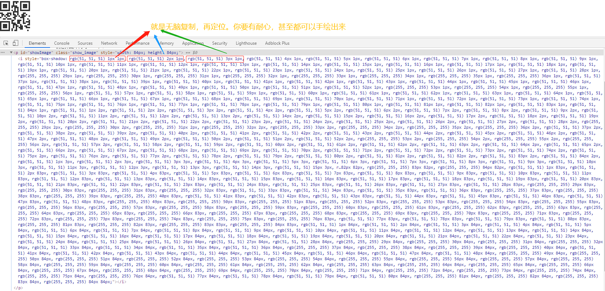
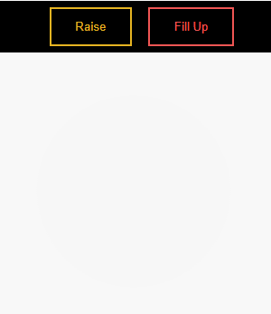

# 盒子阴影

## 一、投影：`box-shadow`属性

> 语法 => `box-shadow: inset ? && <length>{2,4} && <color>?`

- `1st <length>`: 指定 *x-offset(水平偏移值)*。正值绘制一个向盒子右边偏移de阴影，负值则向左偏移
- `2nd <length>`: 指定 *y-offset(垂直偏移值)*。正值绘制一个向盒子底部偏移de阴影，负值则向顶部偏移
- `3rd <length>`: 指定 *blur-radius(模糊半径)*。不允许使用负值。值若为0，阴影的边缘将很清晰；否则，该值越大边缘越模糊
- `4th <length>`: 指定 *spread-radius(扩展半径)*，也有翻译为*spread distance(传播距离)*。正值会使阴影在所有方向上扩展指定的半径；负值会导致阴影缩小。
  - 对于内部阴影，扩展阴影意味着缩小阴影的外围形状
- `inset`: 唯一值为`inset`，表示内阴影；默认不设置，表示外阴影。

顺便提一句，`inset`关键字与色值位置不固定，可以随便放置

```css
/* x偏移量 | y偏移量 | 阴影颜色 */
box-shadow: 60px -16px teal;

/* x偏移量 | y偏移量 | 模糊半径 | 阴影颜色 */
box-shadow: 10px 5px 5px black;

/* x偏移量 | y偏移量 | 模糊半径 | 扩展半径 | 阴影颜色 */
box-shadow: 2px 2px 2px 1px rgba(0, 0, 0, .2);


/* 内阴影 | x偏移量 | y偏移量 | 阴影颜色 */
box-shadow: inset 5em 1em gold;

/* 任意数量的阴影，以逗号隔开 */
box-shadow: 3px 3px red, -1em 0 0 0.4em olive;

/* 全局关键字*/
box-shadow: inherit;
box-shadow: initial;
box-shadow: unset;
```

### 属性效果展示

| Name | Effects |
|:-|:-|
|`x-offset`<br>正值阴影向盒子右侧偏移；负值则向盒子左侧偏移|`box-shadow: 10px 0px #ccc;` `box-shadow: -10px 0px #ccc;` <br>|
|`y-offset`<br>正值阴影向盒子底部偏移；负值则向盒子顶部偏移|`box-shadow: 0px 10px #ccc;` `box-shadow: 0px -10px #ccc;` <br>|
|`blur-radius`<br>值越大边缘越模糊|`box-shadow: 0 0 0 #fff;` `box-shadow: 0 0 10px #fff` `box-shadow: 0 0 50px #fff`|
|`spread-radius`<br>值越大阴影越大; 为负值时，阴影缩小，如右图，表现的效果是抵消了部分水平偏移|`box-shadow: 0 0 0 10px #aaa;` `box-shadow: 0 0 0 50px #aaa;` `box-shadow: 50px 0 0 -20px #aaa;`|
|`inset`|`box-shadow:10px 10px 10px #000` `box-shadow:inset 10px 10px 10px #000` |

chrome较新的版本内置了`shadow editor`可视化编辑盒子阴影工具，可以细品下图，观察值对效果的影响，有条件的家庭（能安装的起chrome），最好自己动手操作一下，上面那些花里胡哨的东东就很容易理解了



### 如何理解box-shadow的inset

你发现没有，单边投影改为内投影后，刚好位置是相反的。。。

就在刚开始观察到`box-shadow`中`inset`这个效果的那一刹那，微微有点懵逼。`box-shadow: 10px 0 #ccc`是在盒子右侧投影的一个阴影块，加上`inset`属性，就变成在内盒左侧投影了一个阴影块。一开始没反应过来哈，你不管内外都给我投影在右侧我多好理解，这一会"外右"，一会儿"内左"的，这哪儿顶的住啊。故作镇定后，试着上网搜了一下`box-shadow inset 投影 光影 阴影`之类的关键词。但是网上没有相关解释。这下就有点慌了，难道这个东西大家都明白就我一个人是懵逼的？。那看来就只有自己想办法了，既然是我们称div这东西为盒子，那就在纸上画了个立方体的空盒子，右侧要有阴影，那么盒子左上方要有一束光打下来，把光源继续左移，那么阴影不就在盒子外侧的右边和盒子内测的左边嘛。。。也就是说`x-offset`为正值时，在盒子的右侧投影，那么内投影一定是在盒子内壁左侧处。。。光学投影，有点儿意思



据说，美术素描投影是很重要的一块儿，有光才有影，有影才证明光的存在，有投影，才能体现素描画的立体。。。

## 二、xue微那么扩展一下（利用盒子阴影绘制图像）

用过ps的都知道里面有**图层**的概念，通俗地讲，图层就像是含有文字或图形等元素的胶片，一张张按顺序叠放在一起，组合起来形成页面的最终效果。那么个人对盒子阴影的理解，就是在元素盒子下面复制多组"没有dom的盒子"，然后对这些"盒子"进行水平、垂直偏移，高斯模糊等等效果，就是达到了实际在浏览器看到的盒子阴影效果。既然是这样，我们也能明白，通过**多层阴影**的**叠加**达到更加花哨的效果，也就是上面语法展示中有提到的`box-shadow: 3px 3px red, -1em 0 0 0.4em olive;`...



同样的，神奇的互联网也有个`Box-shadow_generator`的可视化工具。[免费机票直达！](https://developer.mozilla.org/zh-CN/docs/Web/CSS/CSS_Box_Model/Box-shadow_generator)。


PS中你可以把一张图片多次放大，再绚丽的图像都是`1px*1px`的单位像素构成，万里长城宏伟，也都是一块砖一块砖垒起来的，像素的世界就是这么神奇不是。因此，我们利用一个"1px*1px"的盒子，借助`box-shadow`复制自身，调整颜色，定位；再复制，再定位...



canvas上下文有个getImageData方法，可以获取画布每一个像素点的颜色信息、透明度信息。利用drawImage将靓照原封不动迁到画布上，再利用getImageData获得的像素点信息，转换成box-shadow值，然后呈现之。

理论上，任意的图片，box-shadow都可以呈现。但是，如果你的电脑性能不是很强，最好不要尝试大图片。。嘿嘿

## 来几个duang~duang~duang的特效

```html
<style>
  div.buttons {
    background: #000;
    padding-left: 50px;
  }

  button {
    color: var(--color);
    transition: 0.25s;
  }

  .raise {
    --color: #e6b422;
    --hover: #f0c239;
  }

  .up {
    --color: #f05654;
    --hover: #40de5a;
  }

  .raise:hover,
  .raise:focus {
    box-shadow: 0 0.7em 0.5em -0.4em var(--hover);
    transform: translateY(-0.25em);
  }

  .up:hover,
  .up:focus {
    box-shadow: inset 0 -3.25em 0 0 var(--hover);
  }

  button:hover,
  button:focus {
    border-color: var(--hover);
    color: #fff;
  }

  button {
    background: none;
    border: 2px solid;
    line-height: 1;
    margin: 0.5em;
    padding: 1em 2em;
  }

  .circle {
    position: relative;
    cursor: pointer;
    width: 220px;
    height: 220px;
    overflow: hidden;
    margin: 40px;
    border-radius: 50%;
    background: rgba(0, 0, 0, .032);
    transition: 0.25s;
  }

  .circle:hover {
    background: transparent;
    box-shadow:
      inset 36px 0 0 hsla(90, 50%, 40%, 0.4),
      inset 0 36px 0 hsla(240, 50%, 40%, 0.2),
      inset -36px 0 0 hsla(300, 50%, 40%, 0.2),
      inset 0 -36px 0 hsla(60, 50%, 40%, 0.2);
  }
</style>

<div class="buttons">
  <button class="raise">Raise</button>
  <button class="up">Fill Up</button>
</div>
<div class="circle"></div>
```



**最后，搞一段无趣的文字总结下**：

阴影效果从前到后应用：第一个阴影在顶部，其他阴影在后面。阴影不会影响布局，并且可能与其他框或其阴影重叠。在堆叠上下文和绘画顺序方面，一个元素的外部阴影在该元素的背景正下方绘制，一个元素的内部阴影在该元素的背景正上方（边框和边框下方）绘制图片（如果有）。

如果一个元素有多个框，则所有框都具有阴影，但是阴影仅在也将绘制边框的地方绘制。

阴影不会触发滚动或增加可滚动区域的大小。

外部阴影对折叠边框模型中的内部表格元素没有影响。如果在具有多个边框厚度的折叠边框模型中为单个边框边缘定义了阴影（例如，表中的外部阴影，其中一行具有比其他边框更粗的边框，或者在行跨度表单元格上与单元格相邻的内部阴影），不同的边框粗细），其阴影的确切位置和渲染都不确定

参考链接：

- [W3C box-shadow](https://www.w3.org/TR/css-backgrounds-3/#the-box-shadow)
- [MDN box-shadow](https://developer.mozilla.org/zh-CN/docs/Web/CSS/box-shadow)
- [【前端Talkking】CSS系列-css3之box-shadow介绍](https://segmentfault.com/a/1190000013023632)
- [张鑫旭-CSS3 box-shadow盒阴影图形生成技术](https://www.zhangxinxu.com/wordpress/2013/11/css-css3-box-shadow-%e7%9b%92%e9%98%b4%e5%bd%b1-%e5%9b%be%e5%bd%a2%e7%94%9f%e6%88%90%e6%8a%80%e6%9c%af/)
- 【图解CSS3核心技术与案例实战.pdf】
