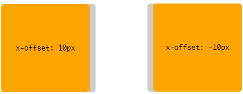
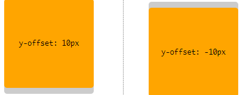

# 盒子阴影

## 一、投影：`box-shadow`属性

> 语法 => `box-shadow: inset ? && <length>{2,4} && <color>?`

- `1st <length>`: 指定一个 *x-offset(水平偏移值)*。正值绘制一个阴影向盒子右边偏移，负值则向左偏移
- `2nd <length>`: 指定一个 *y-offset(垂直偏移值)*。正值绘制一个阴影向盒子底部偏移，复制则顶部偏移
- `3rd <length>`: 指定 *blur-radius(模糊半径)*。不允许使用负值。值为0，阴影的边缘将很清晰。否则，该值越大边缘越模糊
- `4th <length>`: 指定 *spread-radius(扩展半径)*，也有翻译为*spread distance(传播距离)*。正值会使阴影在所有方向上扩展指定的半径。负值会导致阴影缩小。
  - 对于内部阴影，扩展阴影意味着缩小阴影的外围形状
- `inset`: 唯一值为`inset`，存在表示内阴影。默认不设置，表示外阴影。

顺便提一句，`inset`关键字与色值位置不固定，可以随便放置

```css
/* x偏移量 | y偏移量 | 阴影颜色 */
box-shadow: 60px -16px teal;

/* x偏移量 | y偏移量 | 模糊半径 | 阴影颜色 */
box-shadow: 10px 5px 5px black;

/* x偏移量 | y偏移量 | 模糊半径 | 扩展半径 | 阴影颜色 */
box-shadow: 2px 2px 2px 1px rgba(0, 0, 0, .2);


/* 内阴影 | x偏移量 | y偏移量 | 阴影颜色 */
box-shadow: inset 5em 1em gold;

/* 任意数量的阴影，以逗号隔开 */
box-shadow: 3px 3px red, -1em 0 0 0.4em olive;

/* 全局关键字*/
box-shadow: inherit;
box-shadow: initial;
box-shadow: unset;
```

### 属性实际效果展示

#### 1. `x-offset`

> 正值向盒子右侧偏移，负值向盒子左侧偏移

```css
box-shadow: 10px 0px #ccc;
box-shadow: -10px 0px #ccc;
```

#### 2. `y-offset`

> 正值向盒子底部偏移，负值向盒子顶部偏移

```css
box-shadow: 0px 10px #ccc;
box-shadow: 0px -10px #ccc;
```

|22|11<br>11|
|:-|:-|
|1||
|1||

#### 3. `blur-radius`

#### 4. `spread-radius`

#### 5. `inset`

https://developer.mozilla.org/zh-CN/docs/Web/CSS/CSS_Box_Model/Box-shadow_generator

参考链接：

- [W3C box-shadow](https://www.w3.org/TR/css-backgrounds-3/#the-box-shadow)
- [MDN box-shadow](https://developer.mozilla.org/zh-CN/docs/Web/CSS/box-shadow)
- [【前端Talkking】CSS系列-css3之box-shadow介绍](https://segmentfault.com/a/1190000013023632)
- 【图解CSS3核心技术与案例实战.pdf】
