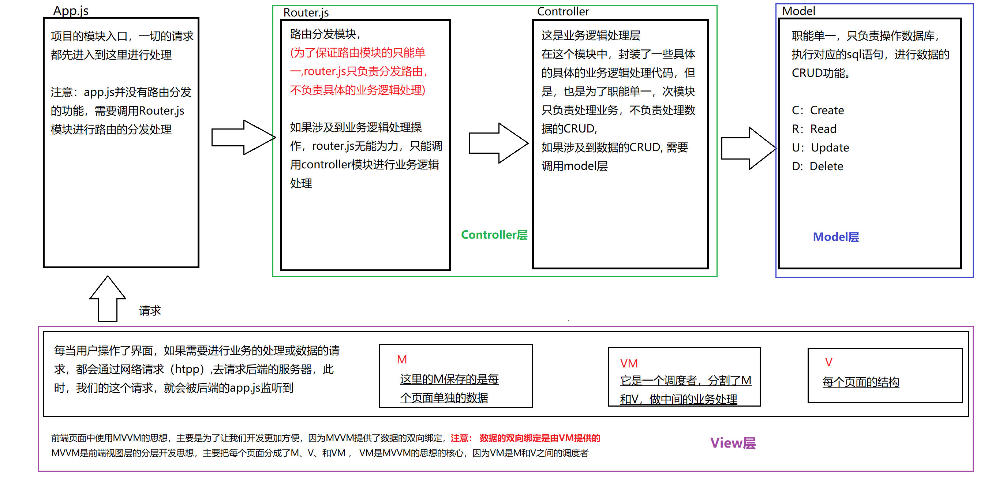

# Vue 传智播客视频学习

## 介绍

> 前端的主要工作是负责mvc中v这一层，主要工作是和界面打交道，来制作前端页面效果

### 前端发展历程

- **原生js**
- **jQuery之类类库**：解决浏览器兼容性,优化dom操作
- **前端模版引擎**: 解决频繁操作dom的问题,但还是会重复渲染
- **Angular.js** 、**Vue.js**、**react.js** : 帮助我们减少不必要的Dom操作，提高渲染效率；双向数据绑定的概念【通过提供的指令，我们前端程序员只需要关心数据的业务逻辑，不再关心DOM是如何渲染的了】

### 库和框架的区别

- 框架： 是一整套解决方案，对项目的侵入型比较大，项目如果要更换框架，则需要重新架构整个项目
- 库(插件)：提供一个小功能，对项目侵入型比较小，如果某个库无法完成某些需求，可以很容易切换

### Node中(MVC)与前端中MVVM的区别

- MVC是后端中分层开发的概念
- Mvvm是前端分层



## 学习VUE

### 插值表达式

{{ messages }}

### 指令学习

- **v-cloak**
- **v-text**
- **v-html**
- **v-bind**: 缩写为: 属性绑定
- **v-on**: 缩写为@ 事件绑定机制(_view上的方法名可以不加小括号，加小括号用于传参_}

### 指令修饰符

- .stop 组织冒泡
- .prevent 阻止默认行为
- .capture 添加事件侦听器时使用捕获机制
- .self 只有当元素本身触发事件执行函数
- .once 事件只执行一次 (@click.prevent.stop也只阻止一次)

### 按键修饰符

```js
Vue.config.keyCodes.f2 =  113
```

### v-model实现双向数据绑定

### 在vue中使用样式

#### 使用class样式

1. 数组
 `<h1 :class="['thin','red']">这是一个很大很大的标题，大道你无法想象</h1>`
2. 在数组中使用三元表达式
 `<h1 :class="['thin','red', flag ? 'active' : '']">又是一个大标题</h1>`
3. 在数组中使用对象
 `<h1 :class="['thin','red', {'active': flag}]">还是一个大标题</h1>`
 `<h1 :class="{red:true,thin:true,italic:true,active:true}">集万千宠爱于一身</h1>`
 `<h1 :class="obj">class用对对象展示</h1>`

#### 使用内联样式

1. 直接在元素上同过`:style`的形式,书写样式对象
  `<h1 :style="{color: 'red', 'font-size': '40px', 'font-weight': '200'}"></h1>`
2. 将样式对象，定义到 `data`中，并直接引用到`:style`中
  `<h1 :style="h1StyleObj">这是一个善良的H1</h1>`
3. 在`:style`中通过数组，引用多个`data`上的样式对象
  `<h1 :style="[h1StyleObj, h1StyleObj1]">这是一个善良的H1</h1>`

### Vue指令之`v-for`和`key`属性

> 2.2.0+的版本里，当在组件中使用v-for时，key现在是必须的

**迭代数组**:

```html
<ul>
  <li v-for="(item, i) in list">索引：{{i}} --- 姓名：{{item.name}} ---年龄：{{item.age}}</li>
</ul>
```

**迭代数组中的属性**:

```html
<div v-for="(val,key,i) in userinfo">{{val}} --- {{key}} --- {{i}}</div>
```

**迭代数字**:

```html
//i是从1开始的
<p v-for="i in 10">这是第{{i}}个p标签</p>
```

### Vue指令之`v-if`和`v-show`

- v-if: 每次都会重新删除或创建元素，性能消耗更高
- v-show：每次不会重新创建元素，只是切换了元素的display: none样式

### 过滤器的使用

```js
//全局定义过滤器
Vue.filter('macfilter', (data) => {
  return data.toString().replace(/([0-9A-F]{2})/gi,"-")
})

//定义私有过滤器
new Vue({
  el: '#app',
  data: {},
  filters: {
    uppercase (data) {
      return data.toString().toUpperCase()
    }
  }
})

//使用
{{ "fd9077cc44aa" | macfilter | uppercase }}
```

### 自定义指令

```js
//全局定义指令
Vue.directive('focus',{
  //第一个参数是el, 被操作的元素
  //第二个参数是binging，一个对象 {name, value, oldvalue, expression, arg, modifiers}
  bind: function (el, binding) { //每当指令绑定到元素上时，立即执行bind函数，只执行一次
    //和属性有关的在此添加
    el.style.color = binding.value
  },
  inserted: function (el) { //inserted表示元素 插入到DOM中时，会执行inserted函数
    //行为有关的在此添加
    el.focus()
  },
  updated: function() { //当vnode更新的时候，会执行updated,可能会触发多次

  }
})

//私有指令
new Vue({
  el: '#app',
  data: {},
  directives: {
    fontweight: {
      bind (el, binding) {
        el.style.fontWeight = binding.value
      }
    },
    fontItalic: function(el, binding) { //简写，等同于在update和bind中各写一份
      el.style.fontStyle = "italic"
    }
  } 
})

<input type="text" class="form-control" v-model="keywords" v-focus v-fontweight="'900'">
```

### Vue实例的生命周期


> 从vue的创建、运行、销毁，总是伴随着各种各样的事件，这些事件，统称为生命周期

```js
new Vue({
    el: '#app',
    data: {
        msg: '别浪~~ !猥琐发育',
    },
    methods: {
        show() {
            console.log('执行了show方法')
        },
        updateMsg () {
            this.msg = 'update msg'
        }
    },
    beforeCreate() { //第一个钩子函数，表示实例完全被创建出来之前，会执行它
        // console.log(this.msg) // =>undefined
        // this.show()  // =>this.show is not a function
        // 注意：在beforeCreate生命周期函数执行的时候，data和methods的数据都还没初始化
    },
    created() {
        console.log(this.msg)
        this.show()
        //在create中 data和methods都已经初始化好了！ 调用methods的方法和操作data的数据，最早只能在这里进行
    },
    beforeMount() { //模板已经在内存中编译成功，尚未在页面挂载
        console.log(document.getElementById('ele-h3').innerText) // =>{{ msg }}
        //在beforeMount执行的时候，页面中的元素还没有被替换，只是之前写的一些模板字符串
    },
    mounted() { //内存中的模板已经挂载到页面中，用户可以看到渲染好的页面了
        console.log(document.getElementById('ele-h3').innerText)
        //mounted是实例创建期间最后一个生命周期函数，接下来就进行到运行阶段
        //如果要通过插件操作页面上的dom节点，最早要在mounted中进行
    },
    beforeUpdate() { //当数据更新时才会触发该事件，界面还没更新
        console.log('界面上元素的内容：' + document.getElementById('ele-h3').innerText) //=> 界面上元素的内容：别浪~~ !猥琐发育
        console.log('data中的msg数据是:' + this.msg) // =>data中的msg数据是:update msg
    },
    updated() { //完成了从model层重新渲染到view层， 页面和data数据保持同步了
        ...
    },
    beforeDestroy() {
        //当执行beforeDestroy钩子函数时，Vue实例就已经从运行阶段，进入到销毁阶段
        //此时实例的data和methods都处于可用状态，还没有真正销毁
    },
    destroyed() {
        //执行到destroyed函数的时候，组件已经被完全销毁，data和methods都不可用了
    },
})
```

### Vue-resource实现get, post, jsonp请求

> - 传统数据请求方式: XMLHttpRequest、Jquery Ajax
> - 常见数据请求类型: get、post、jsonp
> - 除了Vue-resource之外，还可以用'axios'实现数据的请求

```js
this.$http.get('url',[options]).then(successRes => { console.log(successRes.body) }, errorRes => {})
this.$http.post('url',[data],[options]).then(succRes => {}, errorRes => {})
this.$http.jsonp('url',[options]).then(succRes => {}, errorRes => {})
```