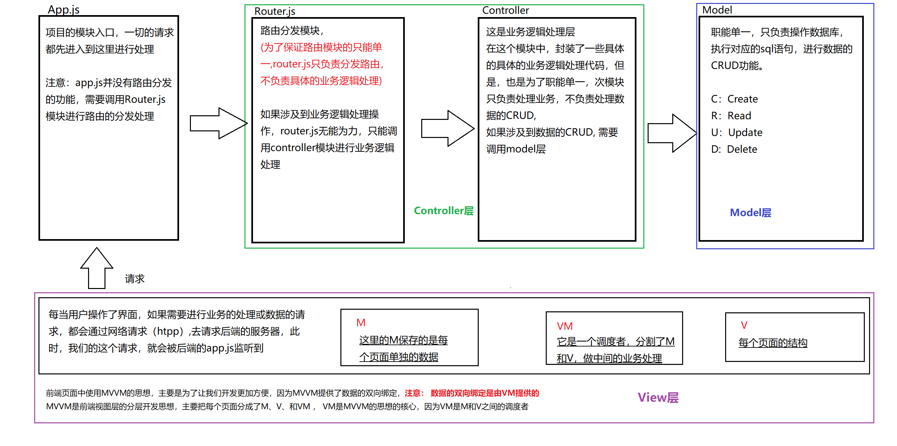

# Vue 传智播客视频学习

## 介绍

> 前端的主要工作是负责mvc中v这一层，主要工作是和界面打交道，来制作前端页面效果

### 前端发展历程

- **原生js**
- **jQuery之类类库**：解决浏览器兼容性,优化dom操作
- **前端模版引擎**: 解决频繁操作dom的问题,但还是会重复渲染
- **Angular.js** 、**Vue.js**、**react.js** : 帮助我们减少不必要的Dom操作，提高渲染效率；双向数据绑定的概念【通过提供的指令，我们前端程序员只需要关心数据的业务逻辑，不再关心DOM是如何渲染的了

### 库和框架的区别

- 框架： 是一整套解决方案，对项目的侵入型比较大，项目如果要更换框架，则需要重新架构整个项目
- 库(插件)：提供一个小功能，对项目侵入型比较小，如果某个库无法完成某些需求，可以很容易切换 

### Node中(MVC)与前端中MVVM的区别

- MVC是后端中分层开发的概念
- Mvvm是前端分层



## 学习VUE

### 插值表达式

{{ messages }}

### 指令学习

- **v-cloak**
- **v-text**
- **v-html**
- **v-bind**: 缩写为: 属性绑定
- **v-on**: 缩写为@ 事件绑定机制

### 指令修饰符

- .stop 须知冒泡
- .prevent 阻止默认行为
- .capture 添加事件侦听器时使用捕获机制
- .self 只有当元素本身触发事件执行函数
- .once 事件只执行一次 (@click.prevent.stop也只阻止一次)

### v-model实现双向数据绑定

### 在vue中使用样式

#### 使用class样式

1. 数组
 `<h1 :class="['thin','red']">这是一个很大很大的标题，大道你无法想象</h1>`
2. 在数组中使用三元表达式
 `<h1 :class="['thin','red', flag ? 'active' : '']">又是一个大标题</h1>`
3. 在数组中使用对象
 `<h1 :class="['thin','red', {'active': flag}]">还是一个大标题</h1>`
 `<h1 :class="{red:true,thin:true,italic:true,active:true}">集万千宠爱于一身</h1>`
 `<h1 :class="obj">class用对对象展示</h1>`

#### 使用内联样式

1. 直接在元素上同过`:style`的形式,书写样式对象
  `<h1 :style="{color: 'red', 'font-size': '40px', 'font-weight': '200'}"></h1>`
2. 将样式对象，定义到 `data`中，并直接引用到`:style`中
  `<h1 :style="h1StyleObj">这是一个善良的H1</h1>`
3. 在`:style`中通过数组，引用多个`data`上的样式对象
  `<h1 :style="h1StyleObj, h1StyleObj1">这是一个善良的H1</h1>`

### Vue指令之`v-for`和`key`属性

> 2.2.0+的版本里，当在组件中使用v-for时，key现在是必须的 

**迭代数组**:

```html
<ul>
  <li v-for="(item, i) in list">索引：{{i}} --- 姓名：{{item.name}} ---年龄：{{item.age}}</li>
</ul>
```

**迭代数组中的属性**:

```html
<div v-for="(val,key,i) in userinfo">{{val}} --- {{key}} --- {{i}}</div>
```

**迭代数字**:

```html
//i是从1开始的
<p v-for="i in 10">这是第{{i}}个p标签</p>
```

### Vue指令之`v-if`和`v-show`

- v-if: 每次都会重新删除或创建元素，性能消耗更高
- v-show：每次不会重新创建元素，只是切换了元素的display: none样式