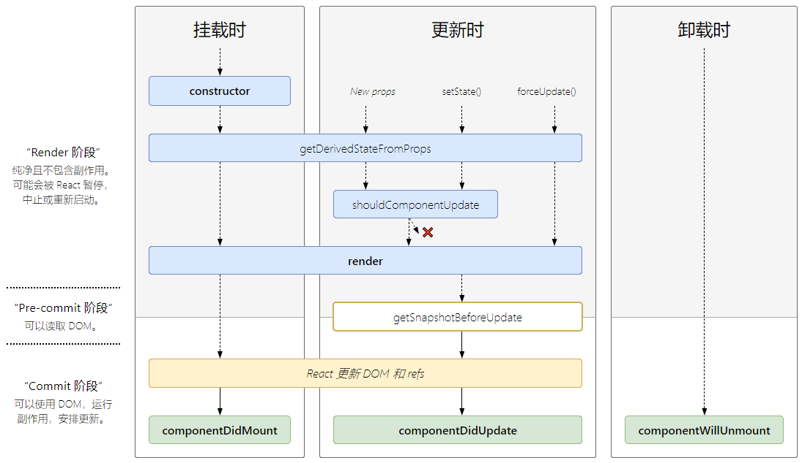

# React

## Getting Start

### Quick Start

#### 利用`create-react-app`直接创建工程

> - 利用`create-react-app`直接创建工程，使用 antd 组件，并自定义 webpack 的配置以满足各类工程化需求

```js
npx create-react-app react.app // npx 临时使用create-react-app 用完后会删除
cd react.app
npm start

npm eject // 自定义配置  源文件不能有任何改动之前就操作这个命令
```

> - react配置暴露后 实现antd按需加载和自定义主题

```js
// 1. 安装babel-plugin-import 和less-loader
npm i babel-plugin-import antd less less-loader

// 2. 修改package.json：添加antd库的样式
"babel": {
  "presets": [
    "react-app"
  ],
  "plugins": [
    [
      "import",
      {
        "libraryName": "antd",
        "style": "css"
      }
    ]
  ]
}

// 3. 修改 config/webpack.config.js

// style files regexes
const cssRegex = /\.css$/;
const cssModuleRegex = /\.module\.css$/;
const sassRegex = /\.(scss|sass)$/;
const sassModuleRegex = /\.module\.(scss|sass)$/;
// 添加以下两行
const lessRegex = /\.less$/;  
const lessModuleRegex = /\.module\.less$/;

// 类比sassModuleRegex, 添加lessRegex和lessModuleRegex 添加到module/rules/oneOf中
{
  test: lessRegex,
  exclude: lessModuleRegex,
  use: getStyleLoaders({ importLoaders: 2 }, 'less-loader'),
},
{
  test: lessModuleRegex,
  use: getStyleLoaders(
    {
      importLoaders: 2,
      modules: true,
      getLocalIdent: getCSSModuleLocalIdent,
    },
    'less-loader'
  ),
},
```

### 配置alias

修改`webpack.config.js`

1. `npm install --global create-react-app`

React组件的数据分为两种，prop和state

prop是组件的对外接口，state是组件的内部状态，对外用prop，内部用state

1. View发起Action->
2. Action传递到Dispatcher->
3. Dispatcher将通知Store->
4. Store的状态改变通知View进行改变

React和Redux构建前端网页: React视图层面 / Redux担当应用状态的管理工作
UI = render(state)

## React中核心概念

### Diff算法

- **tree diff**: 新旧两棵DOM树，逐层对比，就是Tree Diff。当整颗DOM逐层对比完毕，则所有需要被按需更新的元素，必然能够找到
- **component diff**: 在Tree Diff的时候，每一层中，组建级别的对比，叫做Component Diff
  - 如果对比前后，组件的类型相同，则暂时认为此组建不需要被更新
  - 如果对比前后，组件类型不同，则需要移除旧组件，创建新组件，并追加到页面上
- **element diff**: 在进行组件对比的时候，如果两个组件类型相同，则需要进行元素级别的对比，这叫做Element Diff；

### 创建Webpack项目

1. 运行`npm init -y`快速初始化项目
2. 在项目根目录创建`src`源代码目录和`dist`产品目录
3. 在src目录下创建`index.html`
4. 使用cnpm安装webpack, 运行`cnpm i webpack webpack-cli -D`
   * 全局运行 `npm i cnpm -g`安装cnpm
5. 注意：在webpack 4.x中，有一个很大的特性，就是约定大于配置，目的是为了尽量减少配置文件的体积，默认约定：
   * 默认的打包入口路径是: `src/index.js`
   * 默认的打包路径是: `dist`
   * 4.x中新增了`mode`为必选项，可选的值为： `development、production`

### 在项目中使用React

1. 运行`npm i react react-dom -S`安装包
   * react: 专门用于创建组件和虚拟Dom的，同时组件的生命周期都在这个包中
   * react-dom: 专门进行dom操作，最主要的应用场景就是`ReactDOM.render()`
2. 创建容器: `<div id="app"></div>`
3. 导入包: `import React form 'React'; import ReactDOM from 'react-dom'`
4. 创建DOM元素: `const myH1 = createElement('h1', null, '文本内容')`
5. 渲染: `ReactDOM.render(myH1, document.getElementById('app'))`

### Jsx语法

1. 安装bebel插件 (注意：版本7与之前差距很大)
   * 如果有安装先卸载以前的：`npm uninstall --save babel-core babel-preset-* babel-ransform-runtime`
   * `npm i @babel/core babel-loader@8 @babel/preset-env`
   * `npm i @babel/plugin-transform-runtime`
2. 安装能够识别转换jsx语法的包
   * `npm i @babel/preset-react -D`
3. 添加 `.babelrc` 文件

## 模块化的应用要点

架构：

1. 代码文件的组织结构（按功能组织)
2. 确定模块的边界 （高内聚，低耦合）
3. Store的状态树设计

### 代码文件的组织结构

MVC的代码组织方式，(按角色组织)
文件目录：

```js
  |- controllers/
   - todoController.js
   - filterController.js
  |- models/
   - todoModels.js
   - filterModel.js
  |-views/
   - todo.js
   - todoItem.js
   - filter.js
```

Redux应用组织方式,(按功能组织)

```js
  |- todoList/
   - actions.js         // action的构造函数，决定模块可以接受的动作
   - actionsTypes.js    // 定义action类型
   - index.js
   - reducer.js         // 定义动作
    |- views/
     - component.js
     - container.js
  |-filter/
   - action.js
   - actionTypes.js
   - index.js
   - reducer.js
   |- views/
     - component.js
     - container.js
```

### Store的状态树设计

1. 一个模块控制一个状态节点
2. 避免冗余数据
3. 树形结构扁平

Todo状态设计

```js
{
  id: // 唯一标识
  text: // 待办事项内容
  completed: // 布尔值：标识代办事项是否已完成
}

{
  todos: [{
    text: 'First todo',
    completed: false,
    id: 0
  }, {
    text: 'Second todo',
    completed: false,
    id: 1
  }],
  filter: all
}
```

[react实战github源码](https://github.com/mocheng/react-and-redux/tree/master/)

## React知识点

### 1.什么是声明式编程

> 声明式编程时一种编程范式，它关注的时你**要做什么**，而不是**如何做**，它表达逻辑而不显示的定义步骤

```html
<div>
  <p>Declarative Programming</p>
</div>
```

```sql
select * from students where firstName = 'declarative'
```

### 2.声明式编程vs命令式编程

> 声明式编程的编写方式描述了应该怎么做（让编译器完成主要工作），而命令式编程描述了如何做（手动编写所有流程）

```js
const numbers = [1, 2, 3, 4, 5]

// 声明式
const doubleWithDec = numbers.map(number => number * 2)
console.log(doubleWithDec)

// 命令式
const doubleWithImp = []
for(let i=0; i<numbers.length; i++>) {
  const nbumerDouble = numbers[i] * 2
  doubleWithImp.push(numberdouble)
}
console.log(doubleWithImp)
```

### 3.什么是函数式编程

> 函数式编程是声明式编程的一部分。Javascript中函数式第一类公民，你可以像保存变量一样在应用程序中保存、检索和传递这些函数

核型概念：

* 不可变性(Immutability)
* 纯函数(Pure Functions)
* 数据转换(Data Transformations)
* 高阶函数(Higher-Order Functions)
* 递归
* 组合

#### 不可变性

```js
const student = {
  firstName: 'testing',
  lastName: 'testing',
  marks: 500,
}

function changeName(student) { // student对象是不能更该的
  let copiedStudent = Object.assign({}, student)
  copiedStudent.firstName = 'testing11'
  return copiedStudent
}

console.log(changeName(student))
console.log(student)
```

#### 纯函数

```js
const student = {
  firstName: 'testing',
  lastName: 'testing',
  mask: 500
}

// 纯函数
function appendAddress(student) { // 接受参数，基于参数计算，返回一个新对象而不修改参顺
  let copystudent =4 Object.assign({}, student)
  copystudent.address = {streetNumber: '0000', streetName: 'first', city: 'somecity'}
  return copystudent
}
console.log(appendStudent(student))
console.log(student)

// 非纯函数
function appendAddress() { // 没有参数，直接更改student对象来改变全局状态
  student.address = {streetNumber: '0000', steetName: 'first', city: 'somecity'}
}
console.log(appendAddress())
```

#### 数据转换

```js
// 这些javscript内置函数，不改变现有数据，而是返回新的数组或对象
let cities = ['irving', 'lowell', 'houston']
console.log(cities.join(',')) // ircing,lowell,houston
console.log(cities)

const citiesI = cities.filter(city => city[0] === 'i')
console.log(citiesI) // irving
console.log(cities)

const citiesC = cities.map(city => city.toUpperCase())
console.log(citiesC) // ['IRVING', 'LOWELL', 'HOUSTON']
console.log(cities)
```

#### 高阶函数

> 高阶函数是将函数作为参数或返回函数的函数。这些高阶函数可以操纵其他函数。

```js
/* Array.map Array.filter Array.reduce 是高阶函数，因为他们将函数作为参数 */
const numbers = [10, 20, 40, 50, 60, 70, 80]

const out1 = numbers.map(num => num * 10)
console.log(out1) // [100, 200, 400, 500, 600, 700, 800]

const out2 = numbers.filter(num => num > 50)
console.log(out2) // [60, 60, 80]

const out3 = numbers.reduce((out, num) => out + num)
console.log(out3) // 330

const isYoung = age => age < 25
const message = msg => 'He is ' + msg
function isPersonOld(age, isYoung, message) { // 高阶函数，接受另外两个函数为参数
  const returnMessage = isYoung(age) ? message('young') : message('old')
  return returnMessage
}
console.log(isPersonOld(13, isYoung, message))
```

#### 递归

> 递归式函数满足一定条件时调用自身的技术

```js
function printMyName(name, count) {
  if(count <= name.length) {
    console.log(name.substring(0, count))
    printMyName(name, ++count)
  }
}
console.log(printMyName("Bhargav", 1))

// widthout recursion
var name = 'Bhargav'
var output = ''
for (let i = 0; i< name.length; i++) {
  output = output + name[i]
  console.log(output)
}
```

#### 组合

```js
const name = 'Bhargav Bachina'
const output = name.split(' ') // ['Bhargav', 'Bachina']
  .filter(name => name.length > 5) // ['Bhargav', 'Bachina']
  .map(val => {
    val = val.toUpperCase()
    console.log('Name:::::' + val) // Name:::::BHARGAV  Name::::BACHINA
    cosnole.log('Count::::' + val.length) // Count:::::7 Count::::7
    return val
  })
console.log(output) // ['BHARGAV', 'BACHINA']

const name = compose(
  splitmyName,
  countEachName,
  comvertUppercase,
  returnName
)
console.log(name)
```

### 4.什么是react

> React是一个简单的UI库，用于构建高效、快速的用户界面。它使用虚拟DOM来有效的操作DOM,它遵循从高阶组件到低阶组件的单项数据流

### 5.Virtual DOM及其动作原理

1. DOM的本质: 浏览器的概念，用JS对象来表示页面上的元素，并提供DOM对象可操作的API
2. 什么是虚拟DOM: 框架中的概念，用JS对象模拟页面上的DOM和DOM嵌套

### 6.什么是JSX

> JSX是JavaScript的语法扩展。在JSX中，我们结合了javascript和html, 并生成了可以在DOM中呈现的react元素

```jsx
import React from 'react'

export const Header = () => {
  const heading = 'TODO APP'
  return (
    <div style={{background: 'orange'}}>
      <h1>{heading}</h1>
    </div>
  )
}
```

### 7.组件和不同类型

```jsx
import React from 'react'
import { Jumbotron, Form, Button, Row, Col, } from 'react-bootstrap'
import { ToDoForm } from './todoform'
import { ToDolist } from './todolist'
import '../App.css'

// 函数/无状态/展示组件
export const Header = () => {
  return(
    <Jumbotron style={{backgroundColor: 'orange'}}>
      <h1>TODO APP</h1>
    </Jumbotron>
  )
}

// 类/有状态组件
export class Dashboard extends React.Component {
  constructor(props) {
    super(props)
    this.state = {}
  }

  render() {
    return (
      <div className="dashboard">
        <ToDoForm />
        <ToDoList />
      </div>
    )
  }
}

// 受控组件
export class ToDoForm extends React.Component {
  constructor(props) {
    super(props)
    this.state = { value: '', }

    this.handleChange = this.handleChange.bind(this)
    this.handleSubmit = this.handleSubmit.bind(this)
  }

  handleChange(event) {
    this.setState({ value: event.target.value, })
  }

  handleSubmit(event) {
    alert('A name was submitted: ' + this.state.value)
    event.preventDefault()
  }

  render() {
    return (
      <div className="todoForm">
        <Form onSubmit={this.handleSubmit}>
          <Form.Group as={Row} controlId="formHorizontalEmail">
            <Form.Label column sm={1}>
              <span className="item">Item</span>
            </Form.Label>
            <Col sm={5}>
              <Form.Control onChange={this.handleChange} placeholder="Todo Item" type="text" value={this.state.value} />
            </Col>
            <Col sm={2}>
              <Button type="submit" variant="primary">Add</Button>
            </Col>
          </Form.Group>
        </Form>
      </div>
    )
  }
}

// 非受控组件
export class ToDoForm2 extends React.Component {
  constructor(props) {
    super(props)
    this.state = { value: '', }
    this.input = React.createRef()
    this.handleSubmit = this.handleSubmit.bind(this)
  }

  handleSubmit(event) {
    event.preventDefault()
    alert(`A name was submitted: ${this.input.current.value}`)
  }

  render() {
    return (
      <div className="todoform">
        <Form onSubmit={this.handleSubmit}>
          <Form.Group as={Row} controlId="formHorizontalEmail">
            <Form.Label column sm={2}>
              <span className="item">Item</span>
            </Form.Label>
            <Col sm={5}>
              <Form.Control placeholder="Todo Item" ref={this.input} type="text" />
            </Col>
            <Col sm={5}>
              <Button type="submit" variant="primary">Add</Button>
            </Col>
          </Form.Group>
        </Form>
      </div>
    )
  }
}
```

### 8.容器组件和高阶组件

> * 容器组件是处理获取数据、订阅redux存储等的组件
> * 高阶组件是将组件作为参数并生成另一个组件的组件

### 9.Props和State

```jsx
import React from 'react'
import '../App.css'

export class Dashboard extends React.Component {
  constructor(props) {
    super(props)
    this.state = {
      name: 'some name'
    }
  }

  render() {
    const name = this.state.name // rending state
    const address = this.props.address // reading props
    return (
      <div>
        {name}
        {address}
      </div>
    )
  }
}
```

### 10.什么是PropTypes

```js
import React from 'react'
import PropTypes from 'prop-types'

export const UserDisplay = ({ name, address, age, }) => {
  UserDisplay.defaultProps = {
    name: 'myName',
    age: 100,
    address: '0000 onestreet',
  }

  return (
    <>
      <div>
        <div className="lable"> Name: </div>
        <div>{name}</div>
      </div>
      <div>
        <div className="lable"> Address: </div>
        <div>{address}</div>
      </div>
      <div>
        <div className="lable"> Age: </div>
        <div>{age}</div>
      </div>
    </>
  )
}

UserDisplay.propTypes = {
  name: PropTypes.string.isRequired,
  address: PropTypes.objectOf(PropTypes.string),
  age: PropTypes.number.isRequired,
}
```

### 11.如何更新状态以及如何不更新

```js
// 错误方式
this.state.name = "some name"
this.setState({
  timesVisited: this.state.timesVisited + this.props.count
})
// 正确方式
this.setState({ name: 'some name' })
this.setState((state, props) => {
  timesVisited: state.timesVisited + props.count
})
```

### 12.组件生命周期方法



#### 挂载

> 当组件实例被创建并插入DOM中时，其生命周期函数调用顺序如下：

* **constructor**(): 如果不初始化`state`或不进行方法绑定，则不需要为React组件实现构造函数
* static getDerivedStateFromProps(): 会在调用`render`方法之前调用，并且在初始挂载及后续更新时都会被调用。它应返回一个对象来更新`state`，如果返回`null`则不更新任何内容
* **render**():
* **componentDidMount**()：在组件挂载后（插入 DOM 树中）立即调用。依赖于 DOM 节点的初始化应该放在这里。如需通过网络请求获取数据，此处是实例化请求的好地方

#### 更新

> 当组件的`props`或`state`发生变化时会触发更新。组件更新的生命周期调用顺序如下：

* state getDerivedStateFromProps():
* **shouldComponentUpdate**(): 返回`false`，则不会调用`render()`
* render()
* getSnapshotBeforeUpdate()
* componentDidUpdate(): 会在更新后会被立即调用,首次渲染不会执行此方法

#### 卸载

* **componentWillUnmount**(): 当组件从DOM中移除时会调用

#### 错误处理

> 当渲染过程，声明周期，或子组件的构造函数中抛出错误时，会调用如下方法：

* static getDerivedStateFromError()
* componentDidCatch()

#### 即将过期的生命周期函数

* UNSAFE_componentWillMount()
* UNSAFE_componentWillUpdate()
* UNSAFE_componentWillReceiveProps()

## Redux这个鬼东西

> redux和react没有半毛钱关系，react-redux才是react专门针对react的插件

### 一.先玩玩redux

步骤：

1. 引入`createStore`
2. 创建action
3. 创建reducer
4. 创建store
5. 订阅事件和派发事件

```js
import { createStore } from 'redux'

const increase = {
  type: '涨工资'
}
const decrease = {
  type: '扣工资'
}

const reducer = (state = 10000, action) => {
  switch(action.type) {
    case '涨工资': return state += 100;
    case '扣工资': return state -= 100;
    default: return state
  }
}

const store = createStore(reducer)

store.subscribe(() => {
  console.log(store.getState())
})
store.dispatch(increase)
```

### 二.react-redux

步骤：

1. 引入`createStore Provider connect`
2. 创建action
3. 创建reducer
4. 创建store
5. 定义渲染数据的触发行为的方法
6. 连接组件

```js
import React from 'react'
import ReactDOM from 'react-dom'
import { createStore } from 'redux'
import { Provider, connect, } from 'react-redux'

const increase = {
  type: '涨工资'
}
const decrease = {
  type: '扣工资'
}

const reducer = (state = 10000, action) => {
  switch(action.type) {
    case '涨工资': return state += 100;
    case '扣工资': return state -= 100;
    default: return state;
  }
}

const store = createStore(reducer)

function mapStateToProps(state) {
  return {
    tiger: state
  }
}
function mapDispatchToProps(dispatch) {
  return {
    PayIncrease: () => dispatch(increase),
    PayDecrease: () => dispatch(decrease)
  }
}

MyComp = connect(mapStateToProps, mapDispatchToProps)(MyComp)

ReactDOM.render(
  <Provider store={store}>
    <MyComp>
  </Provider>, document.getElementById('root')
)
```
