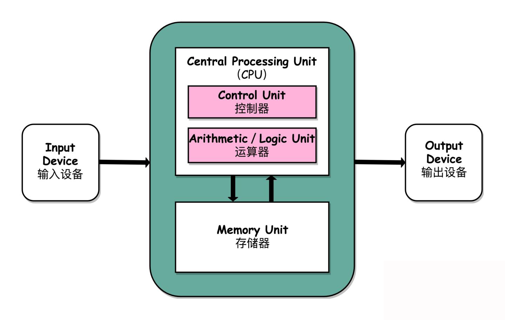
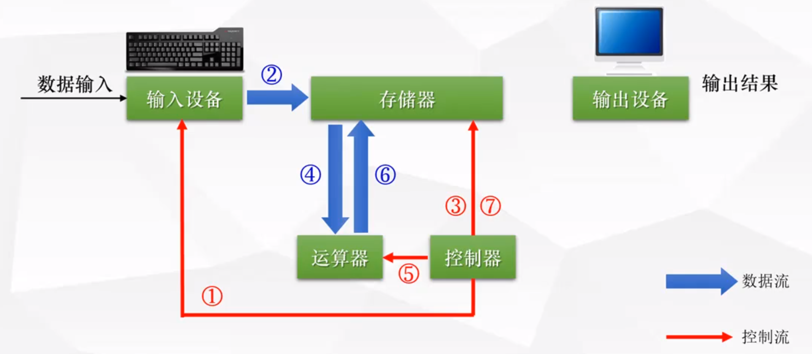
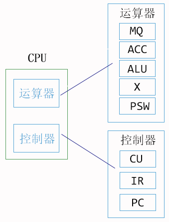
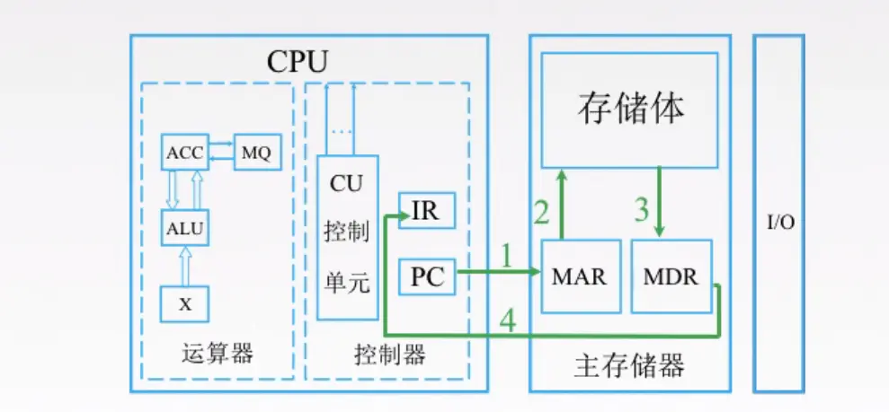
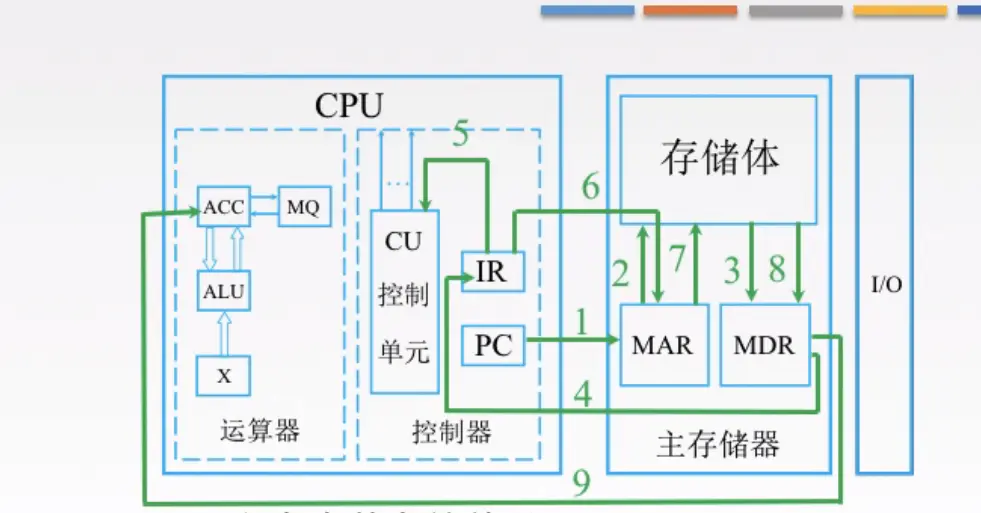

# 计算机原理

## 1.冯·诺依曼体系(现代计算机硬件结构体系)



## 2.计算机的工作原理



1. **控制器**控制**输入设备**(如键盘) --> 指令流向**内存**
2. **控制器**控制**存储器** --> 把数据送到**运算器**
3. **控制器**控制**运算器** --> 将运算结果返回**存储器**
4. **控制器**控制**存储器** --> 将结果返回给**输出设备**(如显示器)

## 3.CPU及其工作过程



### 3.1 运算器主要部件

- **ALU: 算数逻辑单元(Arithmetic logic unit) => 用来进行算数和逻辑运算的**
- ACC: 累加器(Accumulator) => 用来储存计算产生的中间结果
- MQ: 乘商寄存器(Multiplier-Quotient Register)
- X: 操作寄存器
- PSW: 程序状态寄存器(Program Status Word)

### 3.2 控制器主要部件

- **CU：控制单元(Control Unit) => 分析指令，给出控制信号**
- IR：指令寄存器(Instruction Register) => 存放当前执行的指令
- PC: 程序计数器(Program Counter) => 存放指令地址有自动加1的功能

### 3.3 举例 - 取数指令执行过程



- 第一步：PC去存储器的MAR(Memory Address Register)拿要执行的指令地址
- 第二步：MAR去存储体内拿到指令
- 第三步：MAR将指令地址放入MDR
- 第四步：MDR(Memory Data Register)里的数据返回到IR里面



- 第五步：IR将指令存放到CU，来分析指令
- 第六步，第七步：IR去找存储体里的MAR, MAR根据指令去存储体内取数据
- 第八步：取出的数据返回给MDR
- 第九步：MDR里的数据放到运算器的寄存器里

## 4、计算机编程语言

> 机器只识别0和1, 高级编程语言最终都要转化为机器语言

### 高级语言转化为机器语言

1. 一种是借助编译器，将高级语言转化为二进制代码，比如C
2. 一种是解释性的，翻译一行，执行一行，例如js

## 5.进制转换

### 5.1 二进制如何转化为十进制

`1101 => 1*2^3 + 1*2^2 + 0*2^1 + 1*2^0 => 8 + 4 + 0 + 1 => 13`

`101.1 => 1*2^2 + 0*2^1 + 1*2^0 + 1*2^-1 => 5.5`

### 5.2 十进制如何转化为二进制


### 5.3 十进制小数转化为二进制

- 用2乘于十进制小数，取积的整数部分
- 再用2乘于余下的小数部分，继续取整数部分
- 如此进行，直到积中的小数部分为0，或者达到要求的精度

```js
// 十进制0.25转化为二进制：
0.25 * 2 => 0.5 ... 整数部分为0
0.5 * 2 => 1.0 ... 整数部分为1
==> 0.01
```

[参考文献](https://juejin.im/post/5e2fb311f265da3e4244eb4d)
